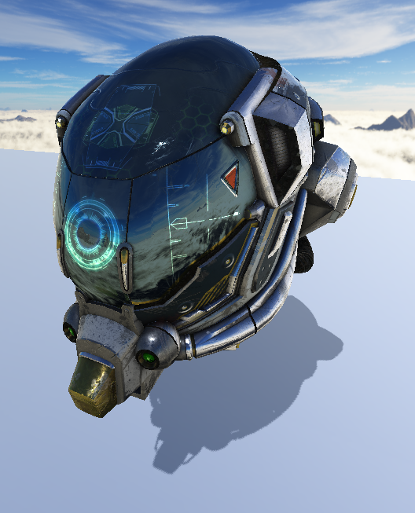
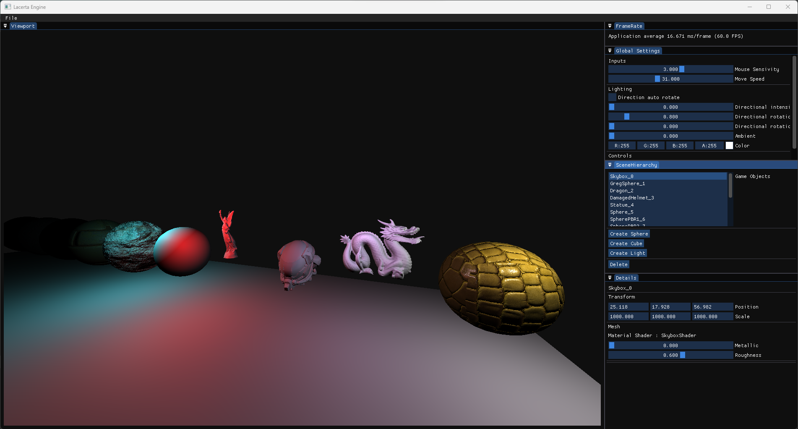

# LacertaEngine

Game Engine made on my spare time to learn engine and graphics programming.
For now, the engine is focused on 3D rendering with a DX11 renderer and a PBR shader.

Features :
* DX11 Forward renderer
* Directional light
* Multiples points lights
* Multiples meshes
* Normal mapping
* PBR Shading (albedo, normal, metallic, ao for now)
* Cube Maps Skyboxes
* ECS with entt
* 2D UI with imgui
* Shadow Mapping
* IBL

| Engine Editor |
|---|
|  |

| Damaged Helmet |
|---|
|  |

| Point Lights | PBR | Shadow Maps |
|---|---|---|
|  |  |  |

Things I want to add :
* Better Cascaded Shadow maps
* Deferred rendering
* DX12 support
* Render thread
* Virtual shadow maps
